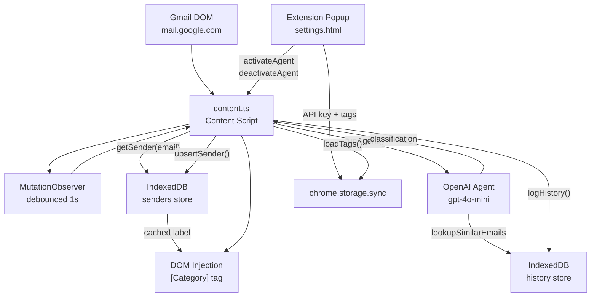
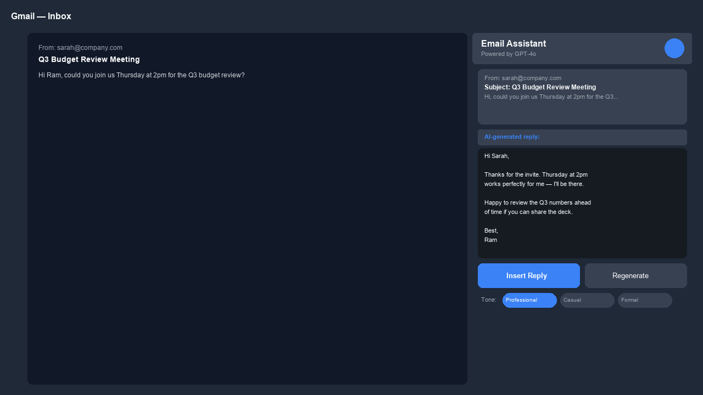
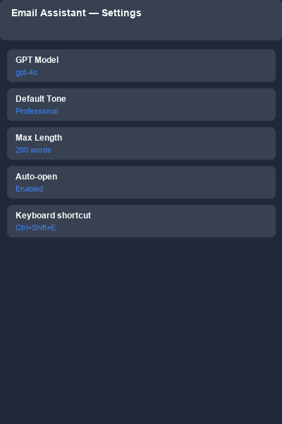
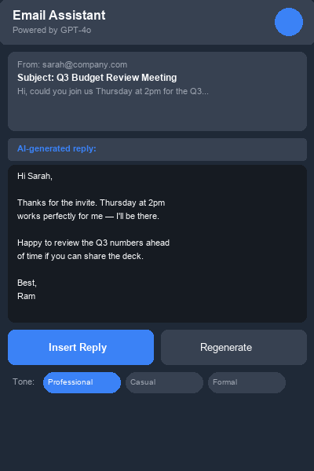
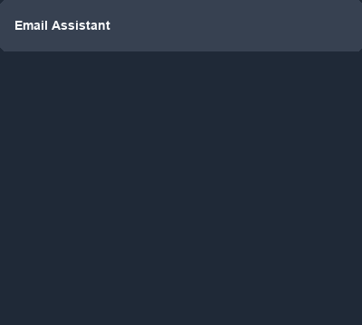

# Email Inbox Agent

[](https://github.com/isidhartha/email-assistant-extension/discussions)

A Chrome extension that runs an AI triage pass over your Gmail inbox and stamps each email with a category label before you read it. You define the categories — things like `Work`, `Newsletters`, `Receipts`, `GitHub` — and the extension uses a GPT-4o-mini agent to classify each email based on the sender, subject line, and snippet preview.

I built this because my inbox was running my day. Too many emails, too little time to actually think about replies — I kept spending 10 minutes crafting something that should've taken two. This extension hooks directly into the Gmail compose window and does the thinking for you, without leaving the tab.

I got tired of opening Gmail and immediately feeling overwhelmed before even reading anything. The labels don't move the emails or auto-archive anything; they just make the inbox scannable at a glance so you can decide in two seconds which threads to open now and which ones to deal with later.

The extension caches classifications in IndexedDB so repeat emails from the same sender don't hit the API again. It also watches for inbox changes via a debounced MutationObserver, so emails that arrive while you're on the page get classified automatically. The whole thing runs from a Manifest V3 content script injected into `mail.google.com`, with the settings popup handling API key storage and category management.

## Features

- **AI email classification** — GPT-4o-mini reads sender address, subject, and snippet and returns one of your user-defined category labels
- **In-page tag injection** — prepends `[Category]` in bold blue to the email's subject line directly in the Gmail DOM without reloading the page
- **User-defined categories** — add and remove labels from the popup; labels sync via `chrome.storage.sync` across devices
- **IndexedDB sender cache** — previously seen senders are stored locally; subsequent emails from the same address reuse the cached label without a new API call
- **Classification history log** — every classification is persisted to IndexedDB with sender, subject, snippet, and timestamp for the agent's `lookupSimilarEmails` tool to use
- **MutationObserver inbox watcher** — debounced at 1 second, re-runs triage whenever Gmail's main pane updates so newly arrived emails get tagged automatically
- **Popup agent toggle** — activate and deactivate the agent from the extension popup; deactivation removes existing tags from the DOM
- **First-run API key setup** — the popup shows an API key input screen on first open; the key is stored in `chrome.storage.sync`
- **Clear database button** — wipes the IndexedDB cache and history from the settings popup when you want a fresh start

## Tech Stack

| Layer | Technology |
|---|---|
| Extension platform | Chrome Manifest V3 |
| AI | OpenAI Agents SDK, `gpt-4o-mini` |
| Local storage | IndexedDB (custom wrapper in `lib/db.ts`) |
| Settings storage | `chrome.storage.sync` |
| Language | TypeScript 5 |
| Styles | Tailwind CSS 4 |
| Bundler | esbuild |

## Setup

```bash
git clone https://github.com/isidhartha/email-assistant-extension.git
cd email-assistant-extension
npm install
npm run build
```

This bundles `content.ts` and `settings.ts` into `extension/dist/` and copies the manifest and HTML files.

Load the extension in Chrome:

1. Go to `chrome://extensions`
2. Enable **Developer mode**
3. Click **Load unpacked** and select the `extension/` folder
4. Open Gmail — the popup will ask for your OpenAI API key on first launch

First-use steps:

1. Click the extension icon, enter your OpenAI API key
2. Add category labels in the settings (e.g. `Work`, `Newsletters`, `GitHub`, `Receipts`)
3. Click **Activate Agent**
4. Gmail inbox subjects will show `[Category]` tags as emails are classified

## Architecture



## Demo





<details>
<summary>Mobile / compact view</summary>



</details>



## Contributing

See [CONTRIBUTING.md](CONTRIBUTING.md) for guidelines.

## License

MIT

## Author

[isidhartha](https://github.com/isidhartha)
