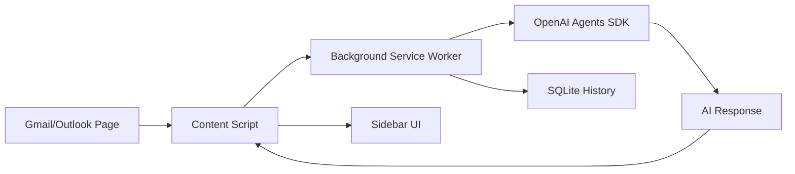

# Email Assistant Extension

A Chrome extension that adds an AI-powered assistant sidebar to your email inbox. Summarises long threads, drafts contextual replies, extracts action items, and keeps a local history — all powered by OpenAI.

## Features

- Email thread summarisation in one click
- AI reply drafting with tone control (formal, casual, concise)
- Action item extraction from long threads
- Local SQLite history — no data sent to third-party servers beyond OpenAI
- Works with Gmail and Outlook Web
- One-click install from the `dist/` folder as an unpacked Chrome extension

## Tech Stack

| Layer | Technology |
|-------|-----------|
| Extension | Chrome Manifest V3 |
| AI | OpenAI Agents SDK |
| Storage | better-sqlite3 (local) |
| UI | Tailwind CSS, TypeScript |
| Validation | Zod |

## Setup

```bash
git clone https://github.com/ramsidhartha/email-assistant-extension
cd email-assistant-extension
npm install
cp .env.example .env   # add OPENAI_API_KEY
npm run build
```

Then in Chrome:
1. Go to `chrome://extensions`
2. Enable **Developer mode**
3. Click **Load unpacked** → select the `dist/` folder

## Architecture



## Screenshots

> 📸 Screenshots coming soon

## Author

Ram Sidhartha
