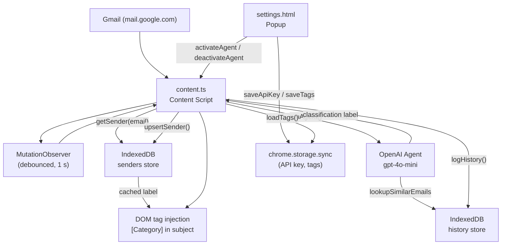

# Email Inbox Agent

[](https://github.com/isidhartha/email-assistant-extension/discussions)

A Chrome extension (Manifest V3) that automatically classifies Gmail inbox emails using an OpenAI-powered agent. Each email subject line is tagged with a user-defined category label in-place, without leaving the page.

---

## Features

- **AI email classification** — a `gpt-4o-mini` agent reads each email's sender, subject, and snippet and assigns it to one of the user-defined categories; unmatched emails are labelled `uncategorised`
- **In-page tag injection** — classification labels are prepended to subject lines directly in the Gmail DOM as bold blue `[Category]` tags
- **User-defined categories** — add and remove category labels from the extension popup; labels are synced via `chrome.storage.sync`
- **Sender cache** — previously classified senders are stored in IndexedDB (`senders` object store); subsequent emails from the same sender reuse the cached label without a new API call
- **Classification history** — every classification is logged to an IndexedDB `history` store (sender email, subject, snippet, category, timestamp); the `lookupSimilarEmails` tool searches this history to improve accuracy
- **MutationObserver inbox watcher** — debounced observer re-runs triage whenever Gmail's main pane changes, so new emails are classified as they arrive
- **Popup controls** — activate / deactivate the agent; opening settings reveals category management and a button to clear the IndexedDB database
- **OpenAI API key onboarding** — on first open the popup shows an API key entry screen; the key is stored in `chrome.storage.sync`

---

## Tech Stack

| Layer | Technology |
|---|---|
| Extension platform | Chrome Manifest V3 |
| AI | OpenAI Agents SDK (`@openai/agents` 0.0.17), `gpt-4o-mini` |
| OpenAI client | `openai` 5 |
| Local storage | IndexedDB (via custom wrapper in `lib/db.ts`) |
| Validation | Zod 3 |
| Language | TypeScript 5 |
| Styles | Tailwind CSS 4 |
| Bundler | esbuild (via npm scripts) |

---

## Permissions (from manifest.json)

```json
"permissions": ["scripting", "activeTab", "storage"]
```

The extension only runs on `https://mail.google.com/*` via a declared content script.

---

## Project Structure

```
email-assistant-extension/
  manifest.json         # Extension manifest (MV3)
  content.ts            # Content script: DOM triage, tag injection, MutationObserver
  settings.ts           # Popup script: API key, category management, agent toggle
  settings.html         # Extension popup HTML
  settings.css          # Popup styles
  lib/
    openai.ts           # Agent definition (gpt-4o-mini), lookupSimilarEmails tool
    db.ts               # IndexedDB wrapper (senders, history, findSimilarEmail)
    local-storage.ts    # chrome.storage.sync helpers for settings and tags
  package.json
```

---

## Architecture



---

## Setup

### Prerequisites

- Node.js 18+
- npm
- An OpenAI API key

### Install dependencies

```bash
npm install
```

### Build the extension

```bash
npm run build
```

This runs the full build pipeline:

1. Cleans the `extension/` output directory
2. Creates `extension/dist/`
3. Copies `manifest.json` to `extension/`
4. Bundles `content.ts` → `extension/dist/content.js` (ESM, esbuild)
5. Bundles `settings.ts` → `extension/dist/settings.js` (ESM, esbuild)
6. Copies `settings.html` → `extension/settings.html`
7. Copies `settings.css` → `extension/settings.css`

### Load in Chrome

1. Open `chrome://extensions`
2. Enable **Developer mode**
3. Click **Load unpacked** and select the `extension/` folder
4. Navigate to Gmail — the popup will prompt for your OpenAI API key on first launch

### First use

1. Click the extension icon and enter your OpenAI API key
2. Add one or more category labels (e.g. `Newsletters`, `Work`, `Receipts`)
3. Click **Activate Agent** while the Gmail tab is active
4. Subject lines will be tagged as emails are classified

---

## Screenshots

<!-- Add screenshots here -->

---

## Author

Ram Sidhartha
